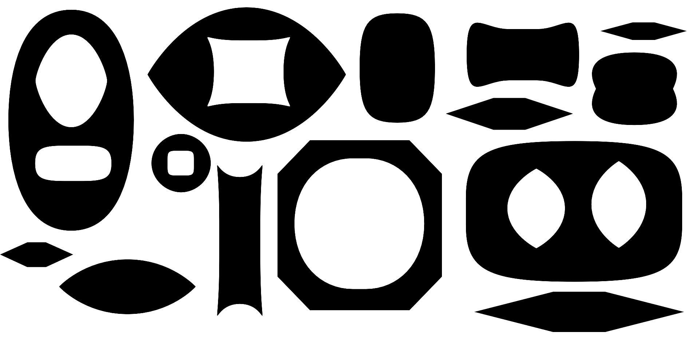
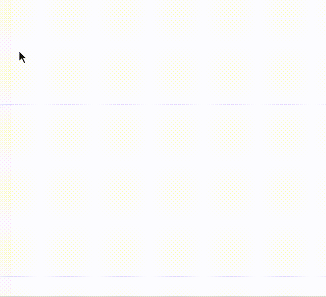

# LettError’s Symmetric Round Shape Drawing Tool

This adds a drawing tool for symmetric round shapes to the Glyph window. You can flat sided ovals, superellipse-like shapes, octagonals.

## command key
Drag with the command key pressed to move the tangent points to make the flats longer and shorter.

## option key
Drag with the option key pressed to move the control points.

## also press control key
..to get some finer control over the position.

The horizontal and vertical values flip when the dragged rectangle goes from ▬ to ▐ and vice versa.

Version 1.0, May 2020